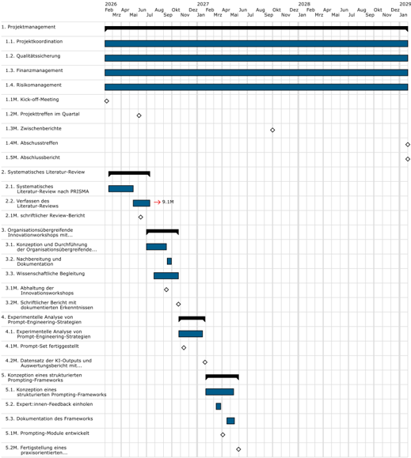
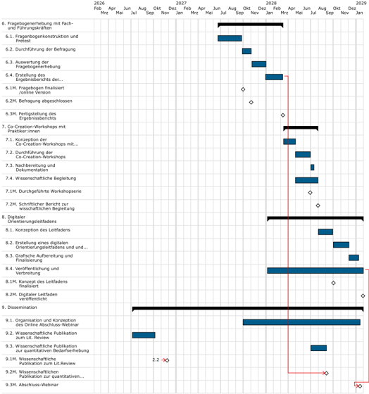

......................................

.........................................

...........................................

..........................................................................

| 1. Projektmanagement ...................................................................... 1        |
|------------------------------------------------------------------------------------------------------|
| 2. Systematisches Literatur-Review ........................................................... 3     |
| 3. Organisationsübergreifende Innovationworkshops mit Führungskräften der Praxispartner:innen . 4    |
| 4. Experimentelle Analyse von Prompt-Engineering-Strategien 6                                        |
| 5. Konzeption eines strukturierten Prompting-Frameworks 6                                            |
| 6. Fragebogenerhebung mit Fach- und Führungskräften 7                                                |
| 7. Co-Creation-Workshops mit Praktiker:innen ................................................... 8   |
| 8. Digitaler Orientierungsleitfadens ............................................................ 10 |
| 9. Dissemination 11                                                                                  |

## 1. Projektmanagement

Das Arbeitspaket Projektmanagement umfasst die gesamte Koordination, Steuerung und administrative Abwicklung des SocialAI -Projekts. Es sichert den erfolgreichen Projektablauf durch systematische Planung, Kontrolle und Anpassung aller Aktivitäten und stellt die Erreichung der Projektziele unter Einhaltung von Budget, Zeitplan und Qualitätsanforderungen sicher.

## Vorgangsweise und Methoden:

- Implementierung einer agilen Projektmanagementmethodik mit quartalsweisen Projekttreffen
- ggf. regelmäßige Statusmeetings (virtuell, monatlich)
- Kontinuierliches Controlling anhand definierter KPIs (Zeitplan, Budget, Deliverables)
- Dokumentenmanagement
- Regelmäßige Berichterstattung an die FFG gemäß Fördervertrag

## Risiken und Lösungsansätze:

- Verzögerungen im Projektverlauf: regelmäßige Fortschrittskontrollen; Pufferzeiten in der Planung; flexible Ressourcenallokation
- Kommunikationsschwierigkeiten im interdisziplinären Konsortium: moderierte Workshops bei komplexen Abstimmungen
- Unterschiedliche Erwartungen der Partner:innen: Klare Zieldefinition und Rollenverteilung im moderierten Kick-off; regelmäßige Erwartungsabgleiche
- Personalwechsel: Wissensmanagement durch strukturierte Dokumentation; Einarbeitung von Stellvertretern für Schlüsselpositionen
- Veränderung rechtlicher Rahmenbedingungen (z.B. AI Act): Monitoring relevanter Regulatorik

Das Projektmanagement stellt durch seine integrierende Funktion sicher, dass alle Diversitätsdimensionen durchgängig berücksichtigt werden und der chancengerechte Ansatz in allen Projektphasen verankert bleibt.

Zeitraum: 01.02.2026 - 31.01.2029

## Meilensteine:

## 1.1. Kick-off-Meeting

Das Kick-off Meeting markiert den offiziellen Projektstart von SocialAI und bringt alle Konsortialpartner zusammen. Während dieser Veranstaltung werden folgende Punkte behandelt:

- Vorstellung aller Projektpartner:innen und deren Expertise/Rollen
- Detaillierung der Arbeitspakete, Verantwortlichkeiten und Zeitpläne
- Festlegung von Kommunikationsstrukturen und Dokumentationsstandards
- Definition von Qualitätssicherungsprozessen mit Fokus auf Diversitätsperspektiven
- Teambuilding zur Förderung der interdisziplinären Zusammenarbeit

## Enddatum: 08.02.2026

## 1.2. Projekttreffen im Quartal

Die Treffen dienen der regelmäßigen Abstimmung aller Konsortialpartner (ggf. monatlich).

## Diese umfassen:

- Statusberichte der Arbeitspakete, Überprüfung des Projektfortschritts
- Diskussion von Zwischenergebnissen, fachlicher Austausch
- Identifikation von Herausforderungen und Lösungsfindung
- Anpassung der Projektplanung bei Bedarf
- Qualitätssicherung und Berücksichtigung der Diversitätsdimensionen
- Abstimmung von Aktivitäten und Verantwortlichkeiten
- Koordination der Dissemination

Jedes Treffen wird dokumentiert Entscheidungen und dient als verbindliche Arbeitsgrundlage. Die Treffen sichern kontinuierliche Kommunikation und effektive Zusammenarbeit im Konsortium.

Enddatum: 05.06.2026

## 1.3. Zwischenberichte

Fachliche Zwischenbereicht und -abrechnungen via Berichtsfunktion des eCall-Systems.

Enddatum: 01.10.2027

## 1.4. Abschusstreffen

Am Ende der Projektlauftzeit ist einn moderiertes Abschlusstreffen aller Konsortialpartner:innen geplant. Dieses finale Meeting dient dazu, die Projektergebnisse zu präsentieren, den Projektverlauf zu reflektieren, Lessons Learned zu dokumentieren und die formale Übergabe der Deliverables durchzuführen. Außerdem werden die Verwertungsstrategien für die Zeit nach dem Projekt konkretisiert und die nachhaltige Nutzung der Ergebnisse sichergestellt. Im Rahmen des Abschlusstreffens wird auch der Endbericht für die FFG besprochen, der die Grundlage für die Auszahlung der letzten Förderrate bildet.

Enddatum: 31.01.2029

## 1.5. Abschlussbericht

Innerhalb von 3 Monaten nach Projektende wird ein fachlicher Endbericht, eine publizierbare Kurzzusammenfassung und eine Endabrechnung via Berichtsfunktion des eCall-Systems eingereicht. Enddatum: 31.01.2029

## Aufgaben:

## 1.1. Projektkoordination

Die Projektkoordination für das Projekt "SocialAI: Chancengerechtigkeit und KI in der Sozialen Arbeit" umfasst folgende Tätigkeiten:

- Gesamtkoordination des interdisziplinären Konsortiums und Sicherstellung einer reibungslosen

Zusammenarbeit zwischen allen Partnern (Forschung, KMU, Praxispartner)

- Organisation der Kick-Off-Veranstaltung und des Abschlusstreffens der Konstortialpartner:innen
- Koordination regelmäßiger Projektmeetings sowie Dokumentation von Entscheidungen
- Steuerung des Projektfortschritts anhand definierter Meilensteine und Zeitpläne
- Koordination der Berichtslegung an die FFG und Einhaltung der Förderbedingungen
- Kommunikation mit externen Stakeholdern, inkl. Teilnahme am Laura Bassi-Netzwerk
- Sicherstellung des Wissenstransfers zwischen Forschungspartnern und Praxis
- Koordination der Disseminationsaktivitäten (Publikationen, öffentliche Veranstaltungen/Webinar)

Zeitraum: 01.02.2026 - 31.01.2029

## 1.2. Qualitätssicherung

Die Qualitätssicherung umfasst folgende Aufgaben:

- Dokumentation von Entscheidungen
- Steuerung des Projektfortschritts anhand definierter Meilensteine und Zeitpläne
- Kommunikation mit externen Stakeholdern, inkl. Teilnahme am Laura Bassi-Netzwerk
- Sicherstellung des Wissenstransfers zwischen Forschungspartnern und Praxis
- Qualitätssicherung der Projektergebnisse (Literatur-Review, Prompting-Framework, Workshops, Leitfaden

Zeitraum: 01.02.2026 - 31.01.2029

## 1.3. Finanzmanagement

Die Aufgabee des Finanzmanagement umfasst:

- Budget-Controlling
- Vorbereitung und Durchfürhrunf der Finanzbereichte
- Manament des Ressourceneinsatzes

Zeitraum: 01.02.2026 - 31.01.2029

## 1.4. Risikomanagement

Die Projektkoordination für das Projekt SocialAI: Chancengerechtigkeit und KI in der Sozialen Arbeit umfasst folgende Tätigkeiten:

- Kommunikation mit Konsortialpartner:innen um technisches Risiko abzuklären,
- Koordination eines kontinuierliches Monitoring technologischer Entwicklungen
- Sicherstellung des Wissenstransfers zwischen Forschungspartnern und Praxis
- Risikomanagement und Entwicklung von Lösungsansätzen bei auftretenden Problemen
- Sicherstellung einer funktionierenden Kommunikation zwischen den Konsortialpartner:innen

Durch diesen proaktiven Ansatz wird sichergestellt, dass potenzielle Hindernisse frühzeitig erkannt und adressiert werden, um den erfolgreichen Projektabschluss und die nachhaltige Wirkung von SocialAI zu gewährleisten.

Zeitraum: 01.02.2026 - 31.01.2029

## Ergebnisse:

## 1.1. Zwischenberichte

Die Zwischenberichte und und Zwischenabrechnungen für die FFG stellen ein umfassendes Dokument dar, das den aktuellen Projektfortschritt, die erreichten Meilensteine sowie die bisherigen inhaltlichen und organisatorischen Ergebnisse des SocialAI-Projekts dokumentiert.

Diese termingerecht über das eCall-System der FFG eingereicht.

## 1.2. Abschlussbericht

Innerhalb von 3 Monaten nach Projektende wird ein fachlicher Endbericht, eine publizierbare

Kurzzusammenfassung und eine Endabrechnung via Berichtsfunktion des eCall-Systems eingereicht.

## 2. Systematisches Literatur-Review

Als Basis wird ein systematisches Review des aktuellen Wissensstands zum Thema chancengerechte KI durchgeführt. Ein Risiko stellt die schnelle Entwicklung von KI und die Aktualität der bestehenden Litertur dar. Zudem stellt ein Eingrenzung der Literatur eine Herausforderung dar. Deshalb orientieren wir uns an dem etablierten PRISMA-Richtlinien, um transparent und umfassend vorzugehen.Die PRISMA-Methode, ein Akronym für Preferred Reporting Items for Systematic Reviews and Meta-Analyses , ist eine systematische Herangehensweise, die in der Wissenschaftswelt weit verbreitet ist, um die Qualität und Transparenz von systematischen Übersichtsarbeiten und Meta-Analysen zu verbessern.

Inhaltlich fließen insbesondere Aspekte zu Gender, Diversity sowie Chancengleichheit, Fairness,

Verantwortung,Transparenz, Datenschutz und Ethik, Soziale Arbeit ein.

Ergebnis ist ein aktueller Wissensstand: Welche Bias in generativer KI sind bekannt? Welche Ansätze gibt es zur Reduktion solcher Bias? Wo bestehen Forschungslücken? - Das Review bildet die Grundlage für unsere weiteren Arbeitspakete.

Deliverable: schriftlicher Review-Bericht, wissenschaftliche Publikation.

Zeitraum: 15.02.2026 - 13.07.2026

## Meilensteine:

## 2.1. schriftlicher Review-Bericht

Abgabe des schriftliche Review-Bericht idealerweise mit einem Flussdiagramm.

Der schriftliche Review-Bericht enthält folgende Angaben:

1. Titel und Abstract
2. Einleitung
3. Methoden
4. Ergebnisse
5. Diskussion
6. Weitere Informationen

Enddatum: 10.06.2026

## Aufgaben:

## 2.1. Systematisches Literatur-Review nach PRISMA

Beim systematischen Literatur-Review nach PRISMA wird nach folgende vier Hauptphasen gearbeitet:

1. Identifikation: Die relevanten Studien durch eine umfassende Literatursuche in verschiedenen Datenbanken. Die Anzahl dieser Studien wird notiert (n = ). Neben den Datenbanken werden weitere Studien durch andere Quellen gefunden. Auch hier wird die Anzahl der Studien notiert (n = ). Nachdem doppelte Einträge entfernt wurden, wird die verbleibende Anzahl der Studien notiert.
2. Screening: Titel und Abstracts der Studien werden Überprüft und es, werden diejenigen aussortiert, die nicht für SocialAI relevant sind. n = wird notiert.
3. Eignung: Die in der Vorauswahl aufgenommenen Studien werden durch eine Volltextanalyse auf Ihre Eignung hin überprüft. Hierbei werden Ein- und Ausschlusskriterien angewandt, und die Anzahl der Studien, die diesen Kriterien entsprechen, wird festgehalten (n = ).
4. Eingeschlossen: Am Ende bleibt eine Gruppe von Studien übrig, die in das Litertur-Review aufgenommen werden (n = ). Diese werden detailliert analysiert und qualitativ codiert. .

Zeitraum: 15.02.2026 - 15.05.2026

## 2.2. Verfassen des Literatur-Reviews

Der schriftliche Review-Bericht enthält folgende Angaben:

1. Titel und Abstract
2. Einleitung
- Hintergrund und Gründe für die Übersichtsarbeit beschreiben
- Ziele und Fragen der Übersichtsarbeit klar angeben

## 3. Methoden

- Einschluss- und Ausschlusskriterien
- Informationsquellen und Suchstrategien detailliert beschreiben
- Auswahl- und Datenextraktionsprozess erklären
- Methoden zur Bewertung des Verzerrungsrisikos und Effektmaße angeben
- Beschreibung, wie Daten aus verschiedenen Studien zusammengeführt und analysiert wurden

## 4. Ergebnisse

- Ergebnisse des Such- und Auswahlprozesses dokumentieren, idealerweise mit einem Flussdiagramm
- Merkmale und Ergebnisse der eingeschlossenen Studien
- Verzerrungsrisiko und Sicherheit der Ergebnisse bewerten

## 5. Diskussion

- Ergebnisse im Kontext interpretieren
- Einschränkungen und Risiken diskutieren
- Implikationen für Praxis und zukünftige Forschung erörtern

## 6. Weitere Informationen

- Informationen zur Registrierung und zum Protokoll der Übersichtsarbeit
- Verfügbarkeit der Daten und Materialien angeben

Zeitraum: 15.05.2026 - 13.07.2026

## Ergebnisse:

## 2.1. Verfassen des Literatur-Reviews und einer wissenschaftlicher Publikation

Vorgänger: 9. Dissemination

## 3. Organisationsübergreifende Innovationworkshops mit Führungskräften der

## Praxispartner:innen

Im Rahmen dieses Arbeitspaketes werden zwei halbtägigen organisationsübergreifenden Innovationsworkshops (N ~ 10-12) durchgführt. Hier werden auf Basis des Design Thinking Ansatzes (Kelley/Brown 2018) Ansatzpunkte für Innovationsprojekte und Einsatzszenarien von KI diskutiert. Das Vorgehen ist zyklisch und iterativ, mit Fokus auf Verstehen, Exploration und Materialisierung. Ziel ist es mit Fach- und Führungskräften der Praxispartner:innen neue Ideen bzw. Ansatzpunkte für Innovationsprojekte zum Einsatzszenarien von KI diskutieren. Design Thinking ist eine innovative Methode zur Bearbeitung von Herausforderungen und zur Entwicklung von neuen Ideen, die sich an den Bedürfnissen der Nutzer:innen orientieren. Das Vorgehen ist zyklisch und iterativ. Im Zentrum des innovativen Entwicklungsprozesses stehen das Verstehen (Worum geht es?), die Exploration (Welche Möglichkeiten gibt es?) und die Materialisierung (Wie können die Ansatzpunkte umgesetzt werden?) (Schmidberger et al. 2022). Der Mehrwert

dieser explorativen, partizipativen Vorgehensweise. Weiters wird vermittelt wie die Bedarfsträger:innen mit den Möglichkeiten Künstlicher Intelligenz verantwortungsvoll umgehen können und dabei Chancen und Risiken gemäß Art 3 Z 56 AI-Act entsprechend zu berücksichtigen. Dabei werden auch datenschutzrechtliche und urheberrechtliche Fragestellungen mit einbezogen.

Zeitraum: 01.07.2026 - 25.10.2026

## Meilensteine:

## 3.1. Abhaltung der Innovationsworkshops

Abhalgung zwei halbtägiger organisationsübergreifenden Innovationsworkshops (N ~ 10-12) mit Fürhungskräften dern Praxispartner:innen (SOS-Kinderdorf &amp; Jugend am Werk).

Enddatum: 11.09.2026

## 3.2. Schriftlicher Bericht mit dokumentierten Erkenntnissen

Der Workshop wird wissenschaftlich begleitet und dokumentiert. Dabei kommen qualitative Forschungsmethoden wie teilnehmende Beobachtung und Prozessdokumentation zum Einsatz. Die wissenschaftliche Begleitforschung ermöglicht eine systematische Erfassung der Diskussionsverläufe, Hindernissen, Lösungs- und Innovationsansätzen sowie Handlungsempfehlungen, die im Rahmen einer anschließenden zusammenfassenden Inhaltsanalyse (Mayring 2015) mit der Software MAXQDA24 ausgewertet werden. Durch diese Auswertung können Muster und Kategorien identifiziert werden, die sowohl für die beteiligten Organisationen als auch für den weiteren wissenschaftlichen Diskurs relevant sind.

Enddatum: 25.10.2026

## Aufgaben:

## 3.1. Konzeption und Durchführung der Organisationsübergreifende Innovationworkshops

Planung der Innovationsworkshops nach dem Design Thinking Ansatzes (Kelley/Brown 2018). Berücksichtigung der Ergebnissse aus dem systemischen Literatur-Review.

Bei der Konzeption ist zu bedenken, dass es eine gute Abgrenzung und trotzdem inhaltiche Verknüpfung zwischen fogenden Themen gewährleistet werden muss:

- Neue Ideen bzw. Ansatzpunkte für Einsatzszenarien von KI in der Sozialen Arbeit diskutiern.
- Vermittlung von Inhalten zur Veranwortungsvollen Nuzung von wie KI in der Sozialen Arbeit.
- Berücksichtigung von datenschutz- und urheberrechtlichen Aspekte und Inhalte in Bezug auf den AI ACt.

Zeitraum: 01.07.2026 - 11.09.2026

## 3.2. Nachbereitung und Dokumentation

Es werden die begleiteten Innovationsworkshops mittels Postskript nachbereitet und schriftlich Dokumentiert. Die Daten werden zudem für die Auswertungsphase aufbereitet.

Zeitraum: 14.09.2026 - 30.09.2026

## 3.3. Wissenschaftliche Begleitung

Erstellung der qualitativen Erhebungsinstrumenten wie teilnehmende Beobachtung und Prozessdokumentation.

Auswertung der Ergebnisse mittels der Inhaltsanalyse (Mayring 2015) mit der Software MAXQDA24

Verfasssen eines schriftlichen Berichts mit dokumentierten Erkenntnissen, Innovationsansätzen und Handlungsempfehlungen sowie einer wissenschaftlichen Auswertung der Workshop-Ergebnisse. Der Bericht umfasst zudem das wissenschaftliche Vorgehens, die angewendeten Methoden und der wichtigsten Ergebnisse.

Zeitraum: 28.07.2026 - 25.10.2026

## Ergebnisse:

## 3.1. Schriftlicher Bericht mit dokumentierten Erkenntnissen,

Der Workshop wird wissenschaftlich begleitet und dokumentiert, wobei qualitative Forschungsmethoden wie teilnehmende Beobachtung und Prozessdokumentation zum Einsatz kommen. Diese im Rahmen der wissenschaftliche Begleitforschung erhobenen Daten werden mittels einer zusammenfassenden Inhaltsanalyse (Mayring 2015) ausgewertet werden. Inhalticher Fokus der wissenschaftlichen Auswertung liegt auf Innovationsansätzen und Handlungsempfehlungen sowie auf Diskursverläufen.

## 3.2. Informationsmaterialien zu AI Act und DSVGO

Hier werden Informationsmaterialien zu AI Act und DSVGO mit besonderem Bezug auf das Feld der Sozialen Arbeit erstellt.

## 4. Experimentelle Analyse von Prompt-Engineering-Strategien

Aufbauend auf den Literaturerkenntnissen untersuchen wir empirisch, wie diverse Prompting-Methoden die Ergebnisse von generativen KI-Modellen beeinflussen. In einer kontrollierten Versuchsreihe werden mehrere KI-Sprachmodelle (z.B. GPT-3.5, GPT-4; gegebenenfalls auch Modelle wie Anthropic Claude oder Meta LLaMA) mit sozialarbeitsrelevanten Aufgabenstellungen getestet.

Ein wesentliches Risiko liegt darin, dass Prompt-Engineering trotz aller Verbesserungen inhärente Grenzen aufweist. Insbesondere bei komplexen Diversitätsdimensionen wie Gender, Ethnie, Alter besteht das Risiko, dass selbst gut gestaltete Prompts nicht alle Bias-Faktoren vollständig eliminieren können. Um diesem Risiko entgegenzuwirken, werden komplementäre Prompting-Techniken parallel evaluiert und kontinuierlich optimiert, basierend auf empirischen Tests und Nutzer:innenfeedback. Wir entwickeln ein standardisiertes Set von ~50 Prompts aus der Praxis (z.B. Fallbeschreibungen, Beratungssituationen, Berichtstexte). Diese Aufgaben werden jeweils ohne spezifische Anleitung und mit gezielt diversitätssensiblen Prompting-Strategien bearbeitet. Unter letzteren verstehen wir z.B. Prompts, die geschlechtersensible Sprache nutzen, Stereotype explizit vermeiden oder die KI anleiten, verschiedene Perspektiven einzunehmen. Die generierten Outputs der Modelle werden anhand quantitativer Bias-Metriken (etwa Gender-Stereotype-Content-Measure, Word Embedding Association Tests für Geschlecht/Ethnie etc.) ausgewertet und zusätzlich qualitativ inhaltsanalytisch beurteilt (z.B. auf subtile Unterschiede in der Rollenbeschreibung von Klient:innen je nach Geschlecht im Prompt).

Zeitraum: 27.10.2026 - 29.01.2027

## Meilensteine:

## 4.1. Prompt-Set fertiggestellt

In Abstimmung mit den Praxispartner:innen werden ~50 Prompts standardisiertes Set aus der Praxis (z.B. Fallbeschreibungen, Beratungssituationen, Berichtstexte) erstellt. Enddatum: 13.11.2026

4.2. Datensatz der KI-Outputs und Auswertungsbericht mit identifizierten wirksamen Prompt-Strategien Schriftliche der Darstellung der Auswertung des generierten Datensatzes: Die generierten Outputs der Modelle werden anhand quantitativer Bias-Metriken (etwa Gender-Stereotype-Content-Measure, Word Embedding Association Tests für Geschlecht/Ethnie etc.) ausgewertet und zusätzlich qualitativ inhaltsanalytisch beurteilt. Enddatum: 29.01.2027

## Aufgaben:

## 4.1. Experimentelle Analyse von Prompt-Engineering-Strategien

Es wird empirisch untersucht, wie unterschiedliche Prompting-Methoden die Ergebnisse von generativen KI-Modellen beeinflussen.

In Abstimmung mit den Praxispartner:innen werden ~50 Prompts standardisiertes Set aus der Praxis (z.B. Fallbeschreibungen, Beratungssituationen, Berichtstexte) erstellt. In einer kontrollierten Versuchsreihe werden diese mit mehrere KI-Sprachmodelle (z.B. GPT-3.5, GPT-4; gegebenenfalls auch Modelle wie Anthropic Claude oder Meta LLaMA) getestet. Die generierten Outputs der Modelle werden anhand quantitativer Bias-Metriken (etwa Gender-Stereotype-Content-Measure, Word Embedding Association Tests für Geschlecht/Ethnie etc.) ausgewertet und zusätzlich qualitativ inhaltsanalytisch beurteilt. Ziel sind empirische Evidenzbasiserte

Prompt-Engineering-Ansätze zu chancengerechten KI-Ausgaben.

Zeitraum: 27.10.2026 - 20.01.2027

## Ergebnisse:

## 4.1. Datensatz der KI-Outputs und Auswertungsbericht

Schriftliche der Darstellung der Auswertung des generierten Datensatzes KI-Outputs mit identifizierten wirksamen Prompt-Strategien.

## 5. Konzeption eines strukturierten Prompting-Frameworks

Basierend auf den experimentellen Ergebnissen wird ein Framework für chancengerechtes Prompting entwickelt.

Konkret entwerfen wir einen modularen Prompt-Baukasten , der verschiedene Formen von Bias gezielt adressiert. Beispielsweise könnten Module enthalten sein: gendergerechte Formulierungen wählen, Mehrfach-Perspektiven anfordern, kulturelle Sensibilität herstellen, Altersstereotype vermeiden etc. Diese Prompt-Patterns werden iterativ in

Feedback-Schleifen mit Expert:innen verfeinert - hier kommen unser Konsortialpartner aus der Geschlechterforschung sowie erfahrene Sozialarbeiter:innen zum Einsatz (Open-Innovation-Ansatz durch externe Perspektiven).

Das Ergebnis ist ein praxiszentrieres Prompting-Framework , das später in Form einer Bibliothek implementiert wird. (Deliverable: dokumentiertes Framework-Konzept, erste Sammlung von Beispiel-Prompts).

Zeitraum: 01.02.2027 - 31.05.2027

## Meilensteine:

## 5.1. Prompting-Module entwickelt

Der Meilenstein umfasst die Entwicklung eines modularen Prompt-Baukastens, der verschiedene Formen von Bias systematisch adressiert und für den Einsatz in der Sozialen Arbeit optimiert ist. Der Baukasten wird in iterativen Feedback-Schleifen mit Expert aus Wissenschaft und Praxis entwickelt und verfeinert, wodurch ein Open-Innovation-Ansatz realisiert wird.

Enddatum: 04.04.2027

## 5.2. Fertigstellung eines praxisorientierten Prompting-Framework

Dieser Meilenstein markiert den Abschluss der Entwicklung eines umfassenden, anwendungsbereiten Prompting-Frameworks für die Soziale Arbeit. Das Framework integriert alle entwickelten Bias-Reduktions-Module in einer kohärenten Struktur mit standardisierten Schnittstellen und Anwendungsregeln. Nach mehreren Evaluationsrunden mit Expert:innen und Praktiker:innen liegt nun ein vollständig dokumentiertes, praxiserprobtes System vor, das unmittelbar in Arbeitsabläufe implementiert werden kann.

Enddatum: 31.05.2027

## Aufgaben:

## 5.1. Konzeption eines strukturierten Prompting-Frameworks

Aufgabe ist es einen modularen Prompt-Baukasten zu entwerfen. Dieser adressiert verschiedene Formen von Bias. Module können etwa folgende Inhalte umfassen : die Verwendung von geschlechtergerechten Formulierungen, die Berücksichtigung mehrerer Perspektiven, die Herstellung kultureller Sensibilität sowie die Vermeidung von Altersstereotypen. Diese Prompt-Patterns werden in einer iterativen Vorgehensweise in Feedback-Schleifen mit Expert:innen adaptiert und verfeinert. In diesem Prozess werden Konsortialpartner aus der Wissenschaft sowie der Sozielen Arbeit eingesetzt, wodurch ein Open-Innovation-Ansatz durch externe Perspektiven realisiert wird.

Zeitraum: 01.02.2027 - 12.05.2027

## 5.2. Expert:innen-Feedback einholen

Die entwickelten Prompt-Patterns werden iterativ in Feedback-Schleifen mit Expert:innen verfeinert - hier kommen unser Konsortialpartner:innen aus der Wissenschaft und Praxis zum Einsatz (Open-Innovation-Ansatz durch externe Perspektiven).

Zeitraum: 10.03.2027 - 27.03.2027

## 5.3. Dokumentation des Frameworks

Diese Aufgabe umfasst die umfassende schriftliche Erfassung und Aufbereitung aller Komponenten des entwickelten Prompting-Frameworks. Dabei werden die Struktur, die einzelnen Module zur Bias-Reduzierung und ihre Wirkungsmechanismen systematisch beschrieben. Die Dokumentation enthält praktische

Anwendungsbeispiele, technische Spezifikationen und Implementierungsrichtlinien für verschiedene KI-Modelle. Sie schließt auch Erkenntnisse aus dem Evaluationsprozess und Empfehlungen zur kontextspezifischen Anpassung ein.

Zeitraum: 18.04.2027 - 16.05.2027

## Ergebnisse:

## 5.1. Dokumentiertes Framework-Konzept und Prompt-Pattern Sammlung

Das Ergebnis ist ein praxistaugliches Prompting-Framework , das eine erste Sammlung von Beispiel-Prompts enthält und später in Form einer Bibliothek implementiert.

## 6. Fragebogenerhebung mit Fach- und Führungskräften

Parallel erfolgt eine Online-Befragung (N ~ 150) bei SOS-Kinderdorf und Jugend am Werk. Es werden sämtliche pädagogischen Fach- und Führungskräfte eingeladen, an der Umfrage teilzunehmen. Der Fragebogen erfasst u.a. Nutzung von KI-Tools im Arbeitsalltag, wahrgenommene Vor- und Nachteile, Kenntnis-/Kompetenzstand sowie persönliche Einschätzungen bzgl. Gender und Diversität. Bei der Auswertung werden demografische Merkmale (Geschlecht, Alter, Migrationshintergrund), äußere Dimensionen (Ausbildung, Berufserfahrung) und organisationale Faktoren berücksichtigt, um präzise Bedarfe zu identifizieren.

Zeitraum: 20.06.2027 - 10.03.2028

## Meilensteine:

## 6.1. Fragebogen finalisiert /online Version

Der standardisierte Fragebogen wurde in den das Onlineerhebungstoll übertragen und kann an die Fach- und Führungskräfte Partner:innen (SOS-Kinderdorf und Jugend am Werk) versendet werden.

Enddatum: 01.10.2027

## 6.2. Befragung abgeschlossen

Mind. 150 Personen haben sich an der Befragung beteiligt und die Erhebung kann beendet werden.

Enddatum: 03.11.2027

## 6.3. Fertigstellung des Ergebnissberichts

Nach Auswertung der Daten wird der die Ergebnisse in einem Bericht (ca. 40 Seiten) schriftlich und grafisch Dargestellt. Dabei wird das Vorgehen, die Auswertung, Stichprobe und Ergebnisse detailliert dargestellt.

Enddatum: 10.03.2028

## Aufgaben:

## 6.1. Fragenbogenkonstruktion und Pretest

Der Fragebogen erfasst u.a. folgende Themenblöcke:

Nutzung von KI-Tools im Arbeitsalltag, wahrgenommene Vor- und Nachteile, Kenntnis-/Kompetenzstand sowie persönliche Einschätzungen, Einstellungen und Erfahrung zur Reproduktion von Ungleichheit z.B. Gender und Diversität.

Bei der Erhebung der demografische Merkmale werden innere Diversitätsdimensionen wie Geschlecht, Alter, Migrationshintergrund äußere Dimensionen wie Ausbildung, Berufserfahrung berücksichtigt.

Hier ist auch die Zusammenarbeit mit den Praxispartner:innen relevant. Das betrifft die Inhalte des Fragebogens aber auch den Feldzugang.

Zeitraum: 20.06.2027 - 24.09.2027

## 6.2. Durchführung der Befragung

Die Onlinefragenerhebung wird entweder mit Software SoSci Survey SoSi, Limesurvey oder https://www.onlineumfragen.com/ durchgeführt.

Bei den teilnehmenden Organisationen (geplant: SOS-Kinderdorf und Jugend am Werk) werden sämtliche pädagogischen Fach- und Führungskräfte eingeladen, an der Umfrage teilzunehmen. Es wird mit N = 150 gerechnet.

Zeitraum: 28.09.2027 - 03.11.2027

## 6.3. Auswertung der Fragebogenerhebung

Quantitative Auswertungen mittels SPSS.

Zeitraum: 05.11.2027 - 02.01.2028

## 6.4. Erstellung des Ergebnisberichts der Bedarfserhebung

Auswertungsbericht der Umfrage mit identifizierten Bedarfen und Diversitätsanalyse der Ergebnisse (ca. 40 Seiten) Zeitraum: 31.12.2027 - 09.03.2028

## Ergebnisse:

## 6.1. Standartisierter Fragebogen

Finalisierter standardisierte Fragebogen für Übertrag ins online Befragungstool. Der Link zum Online-Fragebogen wird an die Praxispartner:innen (SOS-Kinderdorf und Jugend am Werk) zur Dessimination an die Teilnehmenden versendet. Grundgesamtheit bilden die die Sozialarbeitenden Fach- und Führungskräfte der Organisationen.

## 6.2. Datensatz der Befragten (anonymisiert)

Datensatz als SPSS-File und als csv.

## 6.3. Auswertungsbericht der Bedarferhebung

Auswertungsbericht der Umfrage mit identifizierten Bedarfen und Diversitätsanalyse der Ergebnisse (ca. 40 Seiten)

## 7. Co-Creation-Workshops mit Praktiker:innen

Ein weiteres zentrales Risiko liegt in der Akzeptanz durch die Nutzer:innen. Selbst optimal gestaltete Frameworks entfalten keine Wirkung, wenn Fachkräfte den Einsatz verweigern oder Vorbehalte gegen KI-Technologien haben.

Diesem Risiko begegnen wir proaktiv durch eine nutzerzentrierte Co-Creation-Methode, transparente Kommunikation der KI-Funktionalitäten und deren Grenzen sowie gezielte Maßnahmen zur Kompetenz- und Vertrauensbildung.

Basierend auf den Befragungsergebnissen führen wir pro Praxispartner:in vier halbtägige Workshops durch (16-24 Teilnehmende). Die Teilnehmer:innenauswahl erfolgt in Absprache mit den Organisationen. Bei der Auswahl wird auf Diversität geachtet (Geschlecht, Alter, kulturelle Hintergründe, KI-Affinität/KI-Skepsis (Lead User/late Adopters)). In drei Schritten erlernen die Teilnehmenden: 1) KI-Grundlagen mit kritischer Reflexion der Vermenschlichung von KI, 2) praktisches Prompting mit Persona-Definition, Constraint-Prompting, Chain-of-Thought und RAG-basierten Ansätzen, sowie 3) Nutzung der Prompt Pattern Library mit Fokus auf kontinuierliches kritisches Hinterfragen. Zwischen den Workshops liegt eine Praxisphase.

Diese Co-Creation-Workshops werden, wie auch die Innovationsworkshops, wissenschaftlich begleitet.

Zeitraum: 14.03.2028 - 31.07.2028

## Meilensteine:

## 7.1. Durchgeführte Workshopserie

Dieser Meilenstein markiert den erfolgreichen Abschluss einer systematischen Workshop-Serie mit Fach- und Führungskräften der Partnerorganisationen. Die dreiteilige Workshopreihe (Grundlagen KI, Hands-on Prompting, Prompt Pattern Library) vermittelte praxisrelevante Kompetenzen zur chancengerechten KI-Nutzung in der Sozialen Arbeit.

Enddatum: 30.06.2028

## 7.2. Schriftlicher Bericht zur wisschaftlichen Begleitung

Erstellung der qualitativen Erhebungsinstrumenten wie teilnehmende Beobachtung und Prozessdokumentation.

Auswerung der Feedbackprotokolle mittels der Inhaltsanalyse (Mayring 2015) mit der Software MAXQDA24.

Verfasssen eines schriftlichen Berichts mit dokumentierten Erkenntnissen und Anwendungsbereichen sowie Adaptionen zum Konzipierten Framework.

Enddatum: 31.07.2028

## Aufgaben:

## 7.1. Konzeption der Co-Creation-Workshops mit Praktiker:innen

Aufbauend auf den Befragungsergebnissen und des entwickelten Prompting-Framework wird eine Workshop-Reihe (vier halbtägige Workshops, N = 16-24) für ausgewählte Fachkräfte der Partner:innenorganisationen der Sozialen Arbeit (SOS-Kinderdorf und Jugend am Werk) konzipiert und organisiert. Die Teilnehmerauswahl erfolgt in Absprache mit den Organisationen - wichtig ist dabei die Diversität der Teilnehmenden sicherzustellen: unterschiedliche Geschlechter, Altersgruppen, kulturelle Hintergründe, verschiedene Tätigkeitsfelder (von Jugendhilfe bis Behindertenarbeit), sowie sowohl Tech-Affine ('Lead User') als auch eher skeptische oder unerfahrene Personen ('Late Adopters'). So stellen wir sicher, dass vielfältige Perspektiven vertreten sind.

Zeitraum: 14.03.2028 - 30.04.2028

## 7.2. Durchführung der Co-Creation-Workshops

Teilnehmende lernen in drei Schritten einen diversitätssensiblen Umgang mit KI-Tools:

1. Grundlagen KI-Verständnis: Sie lernen, wie LLMs trainiert werden, warum sie bestimmte Verzerrungen aufweisen können und welche Grenzen diese Technologien haben. Dies bildet das Fundament, um die Notwendigkeit diversitätssensiblen Promptings zu verstehen.
2. Hands-on Prompting: Sie bearbeiten reale Fallszenarien aus ihrem Arbeitsalltag und probieren dabei verschiedene Prompt-Techniken aus - etwa den Unterschied zwischen neutralen vs. explizit bias-sensiblen Formulierungen. Es werden praxixnah fortgeschrittene Methoden gezeigt (z.B. Chain-of-Thought-Prompting). Durch Learning-by-Doing erkennen die Fachkräfte unmittelbar, wie Prompting die KI-Ergebnisse beeinflusst und wie sie aktiv gegensteuern können.
3. Einführung der Prompt Pattern Library: Die Prompt-Bibliothek wird vorgestellt - eine kuratierte Sammlung bewährter Prompt-Vorlagen für typische Aufgaben der Sozialen Arbeit. Sie testen ausgewählte Patterns selbst, diskutieren die Resultate und geben Feedback, das wiederum zur finalen Optimierung der Prompting-Frameworks genutzt wird.

Zeitraum: 01.05.2028 - 30.06.2028

## 7.3. Nachbereitung und Dokumentation

Die Nachbereitung und Dokumentation der Co-Creation Workshops umfasst folgende Aufgaben:

Zusammenstellung und Aufbereitung aller Workshop-Ergebnisse, einschließlich der entwickelten Prompts, identifizierten Anwendungsfälle und Optimierungsvorschläge.

Erstellung eines detaillierten Dokumentationsberichts mit Ablauf, methodischem Vorgehen, Teilnehmerstruktur und erzielten Ergebnissen.

Aufbereitung der Workshop-Materialien für die weitere Verwendung, einschließlich Überarbeitung basierend auf dem Feedback der Teilnehmenden.

Lösungsansätze unter besonderer Berücksichtigung von Diversitätsaspekten.

Ableitung konkreter Handlungsempfehlungen für die Integration des Prompting-Frameworks in den Organisationsalltag.

Zusammenstellung von Best-Practice-Beispielen aus den Workshops für den digitalen Orientierungsleitfaden.

Zeitraum: 03.07.2028 - 14.07.2028

## 7.4. Wissenschaftliche Begleitung

Erstellung Instrumenten zur teilnehmenden Beobachtung, Prozessdokumentation und Workshop-Feedback (z.B. Evaluationsbögen und Reflexionsnotizen). Auswertung der Feedbackprotokolle mittels der Inhaltsanalyse (Mayring 2015) mit der Software MAXQDA24. Verfasssen eines schriftlichen Berichts mit dokumentierten Erkenntnissen und Anwendungsbereichen sowie Adaptionen zum Konzipierten Framework.

Zeitraum: 01.05.2028 - 31.07.2028

## Ergebnisse:

## 7.1. Geschulte Multiplikator:innen in den Organisationen

Durch die Workshop-Reihe wurden Fach- und Führungskräfte von SOS-Kinderdorf und Jugend am Werk geschult. Die Teilnehmenden verfügen über fundierte Kenntnisse in KI-Grundlagen, Sensibilisierung für die Vermenschlichung von KI, praktischem Prompt Engineering und der Anwendung der Prompt Pattern Library. Sie sind befähigt, dieses Wissen in ihren Teams weiterzugeben. Die diversitätssensible Zusammensetzung der Gruppe gewährleistet, dass verschiedene Perspektiven in die Organisationen getragen werden. Der Fokus liegt u.a. auf dem empowerment weiblicher Fachkräfte.

## 7.2. Workshop Konzept und Materialien

Das entwickelte Workshop-Konzept besteht aus vier aufeinander aufbauenden Halbtages-Modulen, die speziell auf die Bedürfnisse der Fachkräfte in der Sozialen Arbeit zugeschnitten sind. Die Workshop-Materialien umfassen methodisch vielfältige Lehrunterlagen wie interaktive Präsentationen, praxisnahe Übungsaufgaben, Fallbeispiele und Reflexionstools. Die Konzeption umfasst entwickelte Hands-on-Übungen mit realen Anwendungsfällen aus der Sozialen Arbeit sowie die Dokumentation bewährter Prompt-Patterns für typische Aufgabenstellungen.

## 7.3. Ergebnisdokumentation &amp; Feedbackprotokolle

Verfasssen eines schriftlichen Berichts mit dokumentierten Erkenntnissen und Anwendungsbereichen sowie Adaptionen zum Konzipierten Framework.

## 8. Digitaler Orientierungsleitfadens

Als zentrales Ergebnis wird ein digitaler Leitfaden entwickelt, der die Projekterkenntnisse für die Praxis aufbereitet. Dieser frei zugängliche Leitfaden zum Thema chancengerechtes Prompting fasst die wichtigsten Mythen und Fakten zu KI, Gender und Diversity verständlich zusammen und bietet klare Handlungsempfehlungen.

Kernstück ist ein Prompt-Template-Repository: also die oben erwähnte Prompt Pattern Library als Nachschlagewerk mit vorgefertigten, getesteten Prompts für häufige Aufgabentypen in der Sozialen Arbeit (z.B. Berichtswesen, Formulierung von Unterstützungsplänen, etc.), jeweils mit Hinweisen, welcher Bias damit vermieden wird. Die gesamte Code-Basis und Prompt-Sammlung wird Open Source (MIT-Lizenz) auf GitHub veröffentlicht, um Transparenz, Nachnutzbarkeit und Weiterentwicklung durch Dritte zu ermöglichen. Damit stellen wir sicher, dass die Projektergebnisse über die Laufzeit hinaus lebendig bleiben (Open-Source-Community-Bildung). Zum Projektende werden die Leitfaden-Inhalte in einem Abschluss-Webinar präsentiert, um eine breitere Community von Fachkräften der Sozialen Arbeit zu erreichen.

Zeitraum: 08.01.2028 - 31.01.2029

## Meilensteine:

## 8.1. Konzept des Leitfadens finalisiert

Konzeption des Leitfaden

Enddatum: 02.10.2028

## 8.2. Digitaler Leitfaden veröffentlicht

Die gesamte Codebasis wird unter MIT-Lizenz auf GitHub veröffentlicht, mit Contribution-Guidelines und Issue-Tracking-System.

Enddatum: 30.01.2029

## Aufgaben:

## 8.1. Konzeption des Leitfadens

Es geht um die Entwicklung eines frei zugänglichen digitalen Leitfadens, der die Projektergebnisse für die Praxis aufbereitet und ein Prompt-Template-Repository als Nachschlagewerk enthält.

Zeitraum: 01.08.2028 - 29.09.2028

## 8.2. Erstellung eines digitalen Orientierungsleitfadens und und Implementierung des Prompt-Repositorys Zentrale Aufgabe ist es einen digitalen Orientierungsleitfaden zu Enwickeln, der die gewonnenen

Projekterkenntnisse für die Praxis aufbereitet. Der zu erstellende, frei zugängliche Leitfaden zum chancengerechten Prompting soll die wichtigsten Mythen und Fakten zu KI, Gender und Diversity verständlich zusammenfassen und konkrete Handlungsempfehlungen bieten. Als Kernstück ist ein Prompt-Template-Repository zu konzipieren, das als strukturierte Prompt Pattern Library fungiert. Diese soll als praxisorientiertes Nachschlagewerk mit vorgefertigten, wissenschaftlich evaluierten Prompts für häufige Aufgabentypen in der Sozialen Arbeit (z.B. Berichtswesen, Formulierung von Unterstützungsplänen) dienen, jeweils mit Hinweisen zur Vermeidung spezifischer Bias-Faktoren. Die gesamte Code-Basis und Prompt-Sammlung ist unter Open-Source-Lizenz (MIT) auf GitHub zu veröffentlichen, um Transparenz, Nachnutzbarkeit und Weiterentwicklung durch die Scientific Community zu ermöglichen.

Zeitraum: 02.10.2028 - 04.12.2028

## 8.3. Grafische Aufbereitung und Finalisierung

Qualitätssicherung und Fertigstellung sowie Finalisierung des grafischen Design

Zeitraum: 04.12.2028 - 12.01.2029

## 8.4. Veröffentlichung und Verbreitung

Open-Source-Veröffentlichung und Öffentlichkeitsarbeit

Zeitraum: 08.01.2028 - 31.01.2029

## Ergebnisse:

## 8.1. Digitaler Leitfaden und Prompt-Bibliothek

Der entwickelte digitale Leitfaden stellt eine umfassende, praxisorientierte Ressource für chancengerechtes Prompting in der Sozialen Arbeit dar. Er bietet eine verständliche Aufbereitung von Mythen und Fakten zu KI, Gender und Diversity sowie evidenzbasierte Handlungsempfehlungen für den Arbeitsalltag.

## 8.2. Open-Source-Repository

Das auf GitHub veröffentlichte Open-Source-Repository bildet eine zentrale Wissensplattform für alle Projektergebnisse. Es umfasst die vollständige Prompt-Pattern-Library in maschinenlesbarem JSON-Format, den Code des Prompting-Frameworks und sämtliche Workshop-Materialien. Die klare Strukturierung mit umfassender Dokumentation, Beispielimplementierungen und detaillierten Anwendungshinweisen ermöglicht einen niedrigschwelligen Einstieg für technische und nicht-technische Nutzer:innen.

## 9. Dissemination

Das Arbeitspaket Dissemination umfasst alle Aktivitäten zur systematischen Verbreitung und Kommunikation der Projektergebnisse an unterschiedliche Zielgruppen. Ziel ist es, die gewonnenen Erkenntnisse und entwickelten Ansätze zum Einsatz von KI in der Sozialen Arbeit nachhaltig zugänglich zu machen und einen breiten Wissenstransfer sicherzustellen.

## 1. Wissenschaftliche Publikationen:

- Erstellung von mindestens zwei wissenschaftlichen Fachartikeln für peer-reviewte Journals
- Beiträge zu relevanten Sammelbänden zum Thema KI und Soziale Arbeit
- Working Papers zur Dissemination von Zwischenergebnissen

## 2. Praxisorientierte Publikationen

- Entwicklung und Erstellung eines digitalen Orientierungsleitfadens
- Veröffentlichung einer Prompting-Bibliothek

## 3. Abschlussveranstaltung

- Online-Webinar

Zeitraum: 07.07.2026 - 31.01.2029

## Meilensteine:

## 9.1. Wissenschaftliche Publikation zum Lit.Review

Publikation zum Thema Chancengerechte KI in der Sozialen Arbeit (Arbeitstitel)

Enddatum: 26.11.2026

Vorgänger: 2.2A. Verfassen des Literatur-Reviews

## 9.2. Wissenschaftlichen Publikation zur quantitativen Bedarfserhebung

Verfassen wissenschaftlichen Publikation zur quantitativen Bedarfserhebung

Enddatum: 04.09.2028

Vorgänger: 6.4A. Erstellung des Ergebnisberichts der Bedarfserhebung

## 9.3. Abschluss-Webinar

Präsentation der Forschungsergebnisse im Rahmen eine Online-Webinars für Praxis uns Wissenschaft.

Hier finden einerseits Inputs zu den Forschungsergebnissen statt und andererseits wird der Orientierungsleitfaden präsentiert.

Enddatum: 18.01.2029

Vorgänger: 8.4A. Veröffentlichung und Verbreitung

## Aufgaben:

## 9.1. Organisation und Konzeption des Online Abschluss-Webinar

Das Webinar dient als effektives Format zur Wissensvermittlung und zum direkten Austausch mit Fach- und Führungskräften aus dem Bereich der Sozialen Arbeit. Im Mittelpunkt steht die Präsentation des entwickelten Prompting-Frameworks und des digitalen Orientierungsleitfadens mit besonderem Fokus auf die chancengerechte Nutzung von KI-Technologien.

Die Konzeptionsphase umfasst die Festlegung konkreter Lernziele, die Entwicklung einer zielgruppengerechten inhaltlichen Struktur sowie die Erstellung ansprechender Präsentationsmaterialien. Besonderes Augenmerk liegt auf der Integration interaktiver Elemente wie Fallbeispiele, Live-Demonstrationen und Diskussionsrunden, um die praktische Anwendung des Leitfadens zu verdeutlichen.

Für die technische Umsetzung wird eine benutzerfreundliche Webinar-Plattform ausgewählt, die den reibungslosen Ablauf und die Aufzeichnung der Veranstaltung ermöglicht. Die Teilnehmerakquise erfolgt über etablierte Netzwerke der Projektpartner sowie gezielte Einladungen an relevante Stakeholder im Bereich der Sozialen Arbeit.

Das Webinar wird durch eine Moderation begleitet.

Zeitraum: 01.10.2027 - 18.01.2029

## 9.2. Wissenschaftliche Publikation zum Lit. Review

Publikation zum Thema Chancengerechte KI in der Sozialen Arbeit (Arbeitstitel).

Zeitraum: 07.07.2026 - 07.10.2026

## 9.3. Wissenschaftliche Publikation zur quantitativen Bedarfserhebung

Verfassen einer wissenschaftliche Publikation zur quantitativen Bedarfserhebung.

Zeitraum: 03.07.2028 - 04.09.2028

## Ergebnisse:

## 9.1. Konferenzbeiträge

Erste Projektergebenisse sollen bereits während der Projektlaufzeit auf wissenschaftlichen Tagungne und Konferenzen präsentiert werden.

## 9.2. Abschluss-Webinar

Das Abschluss-Webinar bildet einen zentralen Baustein der Disseminationsstrategie und soll Fach- und Führungskräfte aus dem Bereich der Sozialen Arbeit, Vertreter:innen der Wisschenschafts Commuity erreichen. In dieser interaktiven Veranstaltung werden das Prompting-Framework und der digitale Orientierungsleitfaden praxisnah präsentiert, wobei die chancengerechte KI-Nutzung im Mittelpunkt steht.

## 9.3. Wissenschaftliche Publikation

Es ist geplant Ergebnisse zur quantitativen Bedarfserhebung und zum Literatur-Review während der Projektlaufzeit zu publizieren.

## 9.4. Digitalen Orientierungsleitfaden

Diese wir online Veröffentlich und richtet sich vor allem an die Praxis.

## GANTT-Diagramm

