## Kick-off ' Social AI: Chancengerechtigkeit und KI in der Sozialen Arbeit'

am25.02.2026 von 09:00 bis 15:00 Uhr

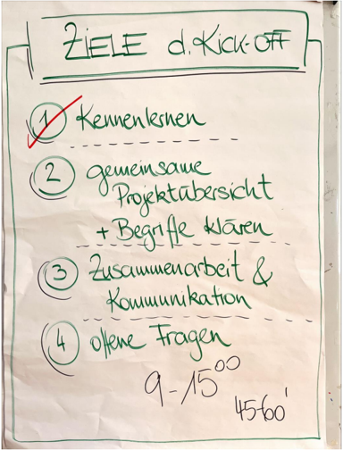

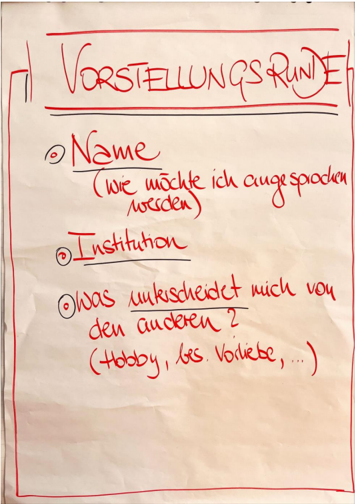

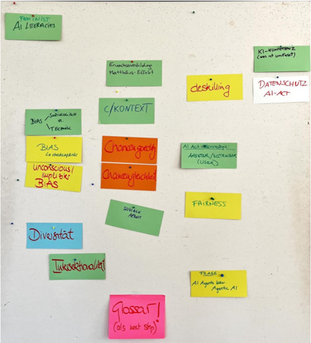

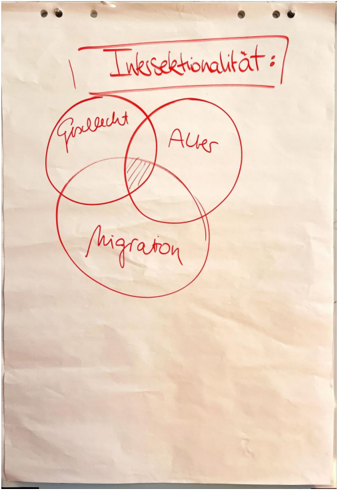

Zeitraum: 01.02.2026 - 31.01.2029

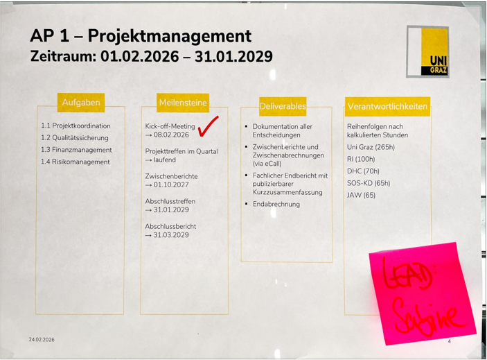

## AP 2 - Systematisches Literatur-Review

Zeitraum: 15.02.2026 - 13.07.2026 NZ.2026

## Aufgaben

- 2.1 Systematisches Literatur-Review nach PRISMA
- →15.02.-15.05.2026
- 2.2 Verfassen des Literatur-Reviews
- →15.05.-13.07.2026

24.02.2026

## Meilensteine

Schriftlicher Review-Bericht →10.06.2026

## Deliverables

- Schriftlicher Review-Bericht
- Wissenschaftliche Publikation(en)

## Inhalt. Ergebnisse:

- AktuellerWissensstand zu Bias in generativer KI
- IdentifizierteAnsatzezur Bias-Reduktion
- Forschungslucken
- Grundlage fur alle weiterenArbeitspakete

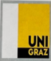

## Verantwortlichkeiten

Reihenfolgen nach kalkulierten Stunden

Uni Graz (160h)

RI(135h)

DHC (70h)

SOS-KD (10h)

JAW(10h)

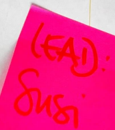

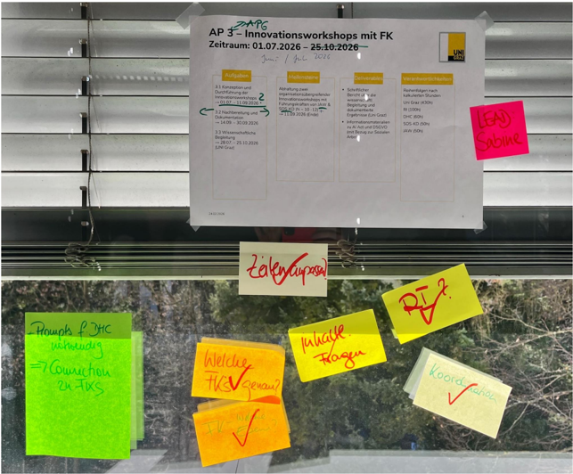

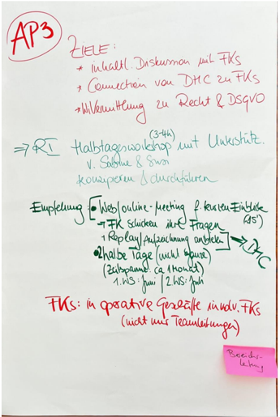

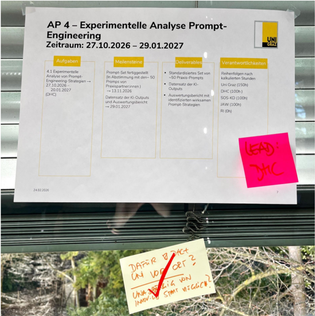

## AP 5 - Konzeption eines strukturierten Prompting-Frameworks

Zeitraum: 01.02.2027 - 31.05.2027

## Aufgaben

- 5.1Konzeption eines strukturiertenPromptingFrameworks
- →01.02.-12.05.2027
- 5.2Expert:innenFeedbackeinholen→ 10.03.-27.03.2027
- 5.3Dokumentation des Frameworks
- →18.04.-16.05.2027

## Meilensteine

Prompting-Module entwickelt (iterativenFeedbackSchleifenmitExpertaus WissenschaftundPraxis) →04.04.2027

Fertigstellung des Prompting-Frameworks praxisorientierten →31.05.2027

## Deliverables

- Dokumentiertes Framework-Konzept
- ·Erste Sammlung von Beispiel-Prompts

## Inhalt.Ergebnisse:

- ·ModularerPromptBaukasten zur BiasReduktion
- ·ValidiertePrompt-Patterns durch Expert:innenFeedback
- PraxiserprobtesSystem fur den Einsatz inderSA

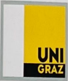

## Verantwortlichkeiten

Reihenfolgen nach kalkuliertenStunden

Uni Graz(110h)

DHC(100h)

SOS-KD (95h)

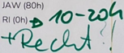

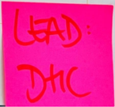

Zeitraum: 20.06.2027-10.03.2028

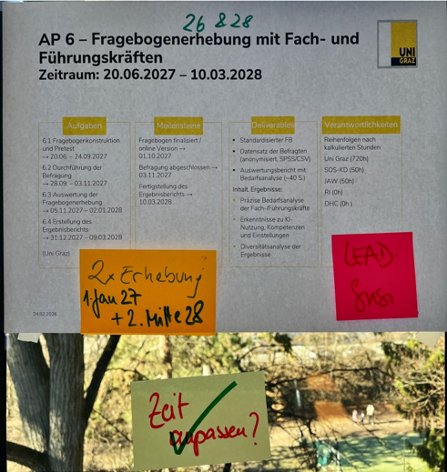

## Praktiker:innen (SOS-KD &amp; JAW)

Zeitraum: 14.03.2028 - 31.07.2028

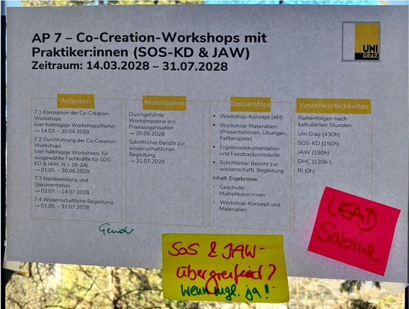

## AP 8 - Digitaler Orientierungsleitfadens (DoL)

Zeitraum: 08.01.2028 -31.01.2029

## Aufgaben

- 8.1 Konzeption des Leitfadens →01.08.-29.09.2028
- 8.2 Erstellung desLeitfadens und Implementierung PromptRepository
- →02.10.-04.12.2028
- 8.3GrafischeAufbereitung und Finalisierung
- →04.12.2028-12.01.2029
- 8.4Veroffentlichung und Verbreitung
- →08.01.2028-31.01.2029

## Meilensteine

Konzept des Leitfadens finalisiert

- →02.10.2028

Digitaler Leitfaden veroffentlicht

- →30.01.2029

## Deliverables

- DOL (frei zuganglich)
- Prompt Pattern Library (Prompt-TemplateRepository)
- Open-Source-Repository auf GitHub(MIT-Lizenz)

## Inhalt. Ergebnisse:

- Praxisorientierte Ressourcefur chancengerechtes Prom.
- Verstandl.Aufbereitung von KI, Gender &amp;Diversity
- Open-SourceVeroffentlichung

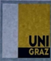

## Verantwortlichkeiten

Reihenfolgen nach kalkulierten Stunden Uni Graz(190h) DHC(170h) RI(100h) JAW(60h) SOS-KD(50h)

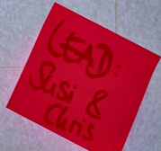

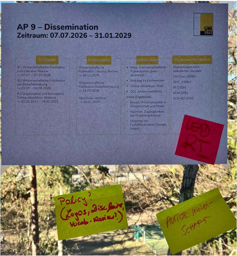

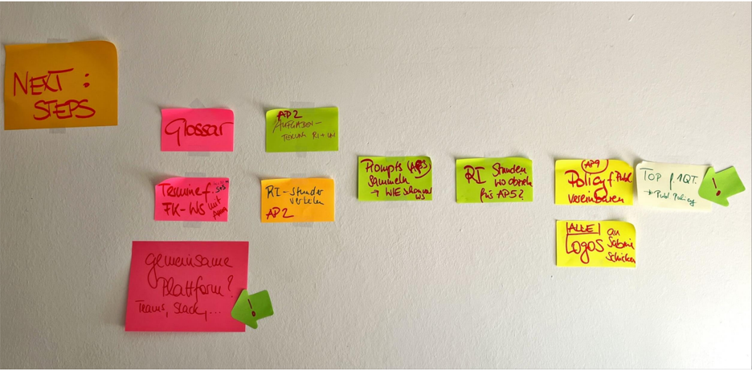

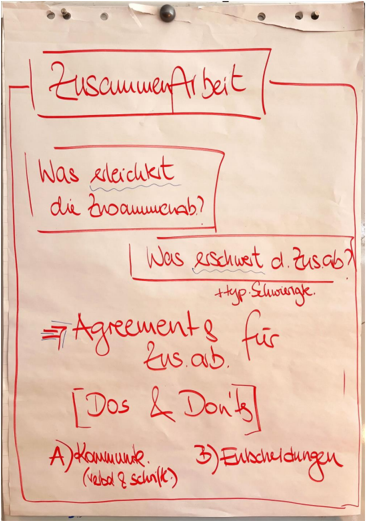

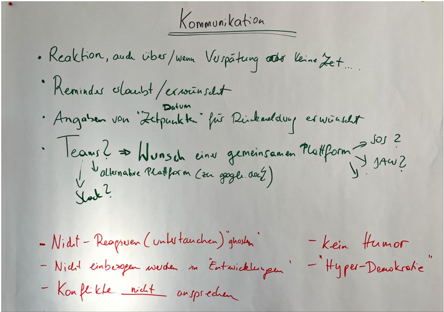

## Entscheidungen treffen

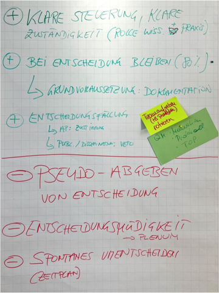

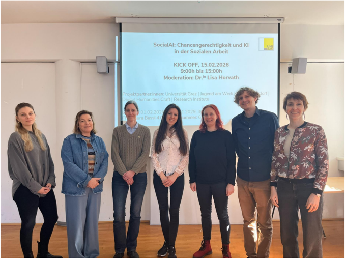

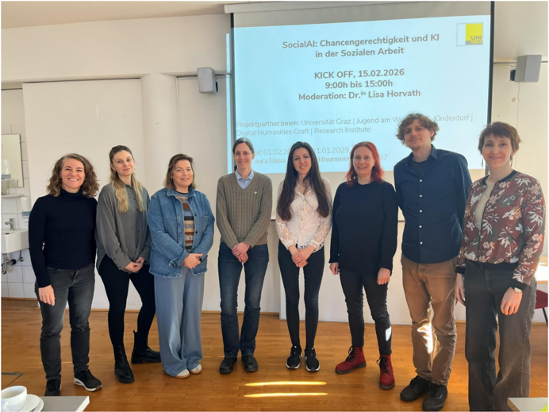